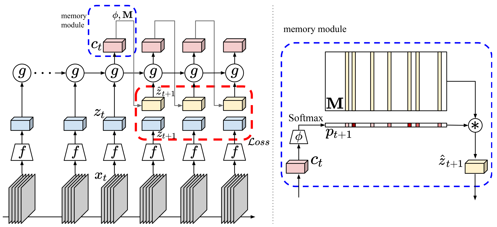
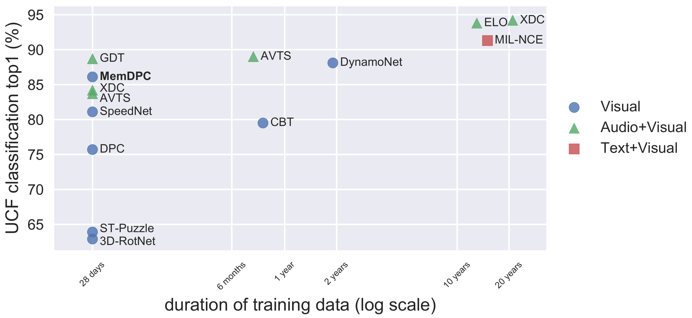

## Memory-augmented Dense Predictive Coding for Video Representation Learning

This repository contains the implementation of Memory-augmented Dense Predictive Coding (MemDPC). 

Links: [[arXiv](https://arxiv.org/abs/2008.01065)] [[PDF](http://www.robots.ox.ac.uk/~vgg/publications/2020/Han20/han20.pdf)] [[Video](https://www.youtube.com/watch?v=XlR7QoM053k)] [[Project page](http://www.robots.ox.ac.uk/~vgg/research/DPC/)]



### News

* 2020/08/26: correct the DynamoNet statistics in the figure. DynamoNet uses 500K videos from Youtube8M but only use 10-second clip from each, totally the video length is about 58 days. 

### Preparation

This repository is implemented in PyTorch 1.2, but newer version should also work.
Additionally, it needs cv2, joblib, tqdm, tensorboardX. 

For the dataset, please follow the instructions [here](process_data/).


### Self-supervised training (MemDPC)

* Change directory `cd memdpc/`

* Train MemDPC on UCF101 rgb stream
```
python main.py --gpu 0,1 --net resnet18 --dataset ucf101 --batch_size 16 --img_dim 128 --epochs 500
```

* Train MemDPC on Kinetics400 rgb stream
```
python main.py --gpu 0,1,2,3 --net resnet34 --dataset k400 --batch_size 16 --img_dim 224 --epochs 200
```

### Evaluation

Finetune entire network for action classification on UCF101:


Code comming soon.

### MemDPC pretrained weights

Comming soon.

### Citation

If you find the repo useful for your research, please consider citing our paper: 
```
@InProceedings{Han20,
  author       = "Tengda Han and Weidi Xie and Andrew Zisserman",
  title        = "Memory-augmented Dense Predictive Coding for Video Representation Learning",
  booktitle    = "European Conference on Computer Vision",
  year         = "2020",
}
```
For any questions, welcome to create an issue or contact Tengda Han ([htd@robots.ox.ac.uk](mailto:htd@robots.ox.ac.uk)).


